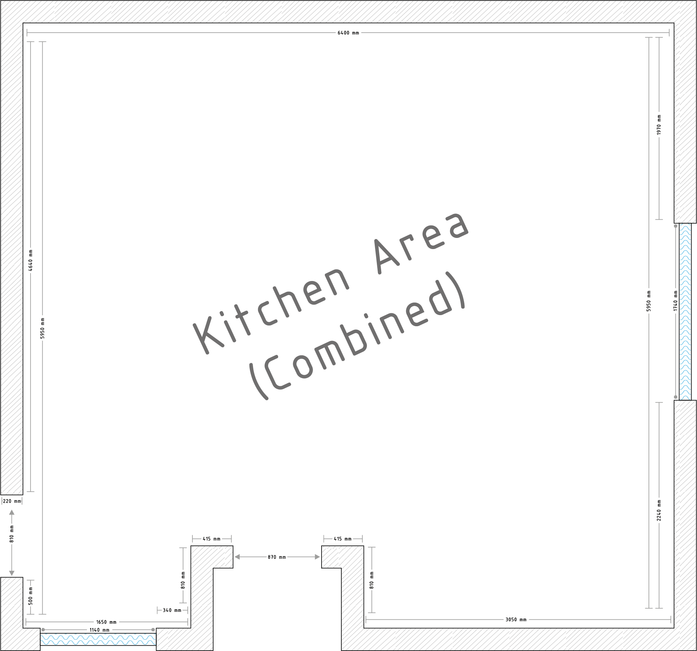
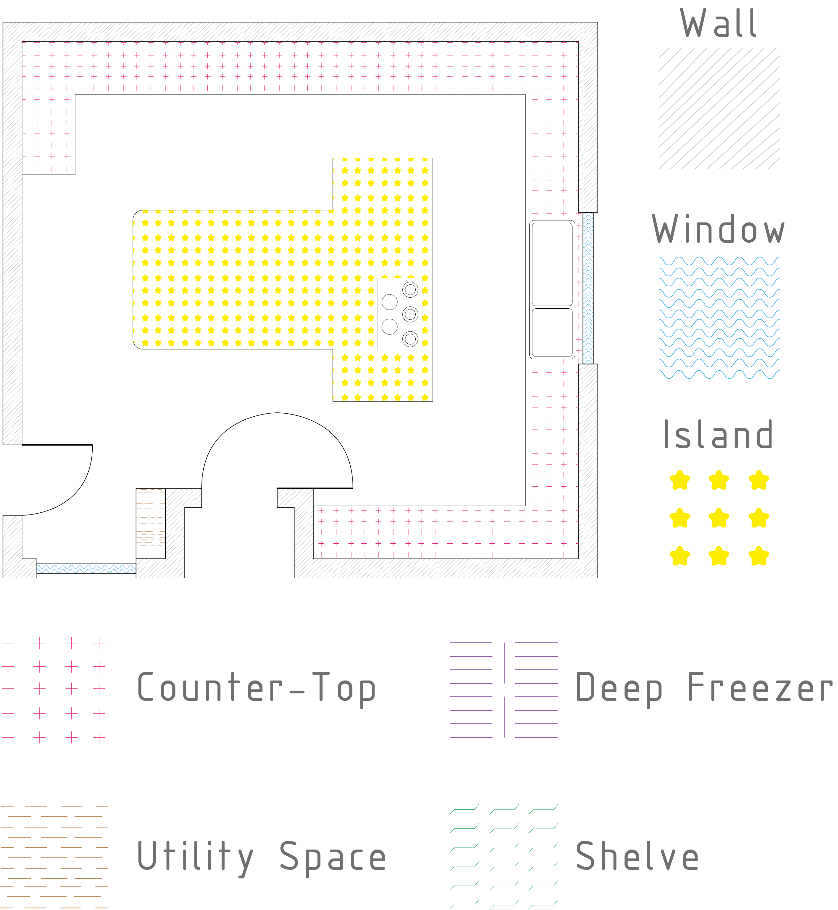
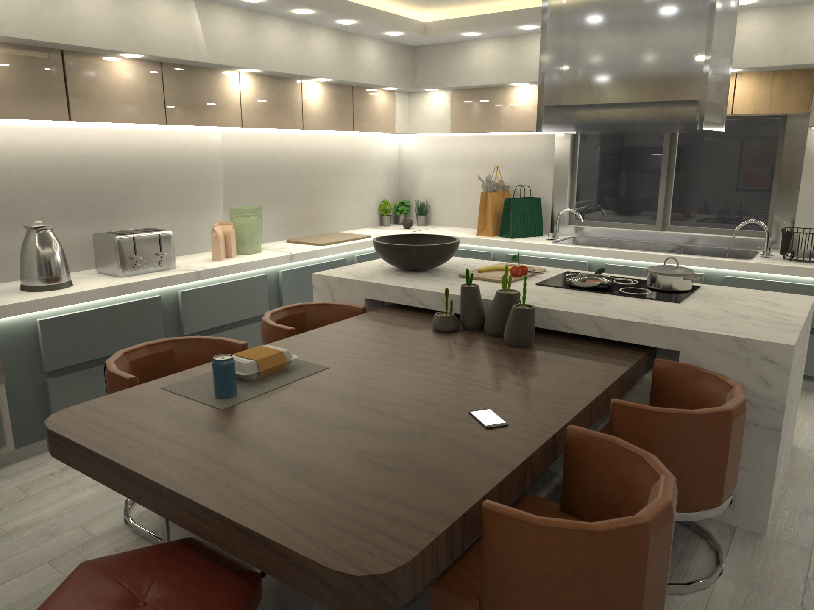

# Development Profile

**Quick Links**

- [Meta Information](#meta-information)
- [Development Stack](#development-stack)
- [Examples](#examples)

## Meta Information

- [Back to Main Navigator](#development-profile)

**Name:** Lewis Mosho Jr  
**Title:** Software Engineer  
**D.O.B:** 14<sup>th</sup> July 2000

**Credentials**

1. Software Engineer

   - Hobby
   - 4 Years of Experience

2. Financial Analyst

   - BSc Finance (2020 @ Webster University Geneva)
   - Emphasis in derivatives and economics

3. Architecture

   - Hobby
   - Schematics
   - Photoreal 3D visualisations
     - Interior design
     - Building design
   - Rooms, items/objects, and buildings

4. Law Student

   - Bachelor of Laws (1<sup>st</sup> year @ University of Zambia)

## Development Stack

- [Back to Main Navigator](#development-profile)

**Python**

```bash
├── Cross Platform Desktop Software and Apps
├── APIs
├── Web Services
|   ├── Responsive Web Apps
|   ├── Mobile Friendly Web Apps
├── Multi Language Integrations
    ├── C++
```

**Javascript**

```bash
├── Vanilla js
├── React
    ├── React.js
    ├── React Native
    |   ├── iOS
    |   ├── Android
    ├── Next.js
├── APIs
├── Web Services
    ├── Responsive Web Apps
    ├── Mobile Friendly Web Apps
```

**Third Party Integrations**

```bash
    ├── imgur
    ├── Docker
    ├── Heroku
    ├── MongoDB
    ├── SupaBase
    ├── Firebase
    ├── AWS
    ├── Cybersecurtiy
        ├── Data and Password Encryption
        ├── Endpoint Authentication
            ├── Tokens
            ├── IP Address
```

## Examples

- [Inventory Manager](#inventory-manager)
- [eCommerce App](#ecommerce-app)
- [eMenu System](#ecommerce-app)
- [Interior Design](#interior-design---kitchen)
- [Back to Main Navigator](#development-profile)

### Inventory Manager

- [Back to Navigator](#examples)

**Features**

- Cost forecasting
  - Generate a budget
  - Save the budget
  - Segment the budget into its constitutent stores, items, and respective prices
- iOS and Android compatible
- Logs of every alteration to the database are visible for accountability
- Easily add/edit entry data (e.g the quantity)
- Scalable and adaptable
  - e.g You could use it for a manufacturing company, or a mini mart
- Filtering of entries
- Push notifications
  - For events such as a new item added

[User Interface Sample - iOS](https://youtube.com/shorts/5lgcHEnxqfw?feature=share)

### eCommerce App

- [Back to Navigator](#examples)

**Features**

- Search
  - By seller name
  - By item name
  - Space and case agnostic
- iOS and Android compatible
- Customise cart
  - Add/edit/remove items directly from cart page
- Push notifications
  - For events such as order status (for customers) or order made (for sellers)

[User Interface Sample - iOS](https://youtube.com/shorts/_OfJOteNhiQ?feature=share)

[User Interface Sample - Android](https://youtube.com/shorts/Ig1B9Gt5dj4?feature=share)

### eMenu System

- [Back to Navigator](#examples)

**Features**

- Mobile friendly web page (customers)
  - Custom company logo
  - Dynamic link (e.g www.website.com/{company name})
  - Dark mode
    - Remebers if someone prefers dark or light mode and applies it to every menu
  - Search
    - By item name, description, or price
  - Connect to company
    - Social media profiles
    - Phone number
- Admin panel

  - Payments
    - Receipts
    - Auto renewal
    - Mulitple forms of payment accepted
  - Customise page
    - Link name
    - Social media profiles
    - Phone number
    - Backgorund colour
    - Text colours
      - Prices
      - Food families
      - Food items
    - Background graphic
    - Logo
    - QR Code
      - Generate
      - Customise code colours

- [Full Preview - Laptop/Computer](https://www.youtube.com/watch?v=n2XOe7DJYpg)
- [Admin Console Preview - Laptop/Computer](https://www.youtube.com/watch?v=EPyTvzbfAeU)
- [Admin Console Preview - Mobile](https://youtube.com/shorts/_c2A8gQQfgY?feature=share)

### Interior Design - Kitchen

- [Back to Navigator](#examples)

**Schematics**




**Visualistations**




